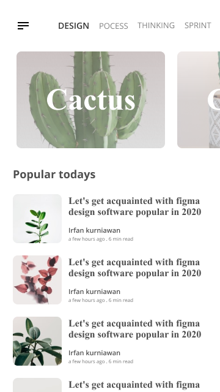
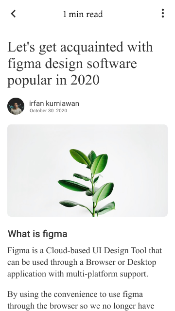
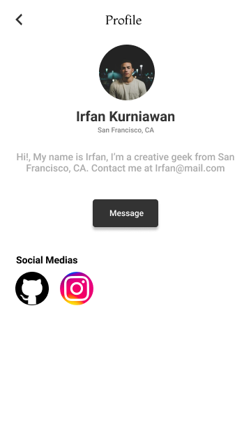
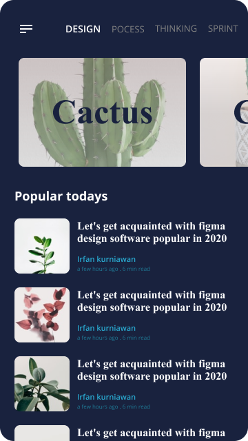
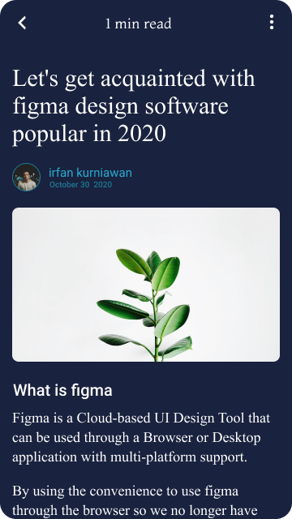

# Projeto Blog

Este projeto é a criação de um blog em flutter que tem a finalidade tanto, de aprender a utilizar o dart/flutter, quanto, criar um lugar onde as pessoas podem buscar conhecimento em suas postagens.

## Estrutura

O projeto foi feito utilizando o Modular com o gerenciador de estados Mobx.

## Telas

### Light Theme

  
  
  

### Dark Theme

  
  

## Lista de tarefas

- [ ] Splash Screen
- [x] List Posts UI
- [ ] Detail Post UI
- [ ] Detail Profile UI
- [ ] List Post Programming
- [ ] Detail Post Programming
- [ ] Detail Profile Programming

